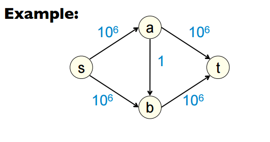

# Testaus

## Oikeellisuus

Testasin kattavasti toteuttamiani algoritmeja ja tietorakenteita. Jokaiselle algoritmille tein sekä pienillä että isoilla syötteillä oikeellisuustestausta, eli että ne palauttavat oikean tuloksen. Lisäksi tein testit tietorakenteilleni `vector` ja `queue`, varmistaen että jokainen metodi ja kuormitettu operaattori toimii toivotusti.

Nämä testit voi ajaa `make -B -C src test`-komennolla projektin juuresta. Tämä kääntää koodin ja ajaa oikeellisuustestit (ei suorituskykytestejä). Testit on toteutettu [Catch](https://github.com/philsquared/Catch)-frameworkillä, joten tulotus näyttää suurinpiirtein tältä:

```bash

All tests passed (87 assertions in 23 test cases)

```
Flow-algoritmeille testit varmistavat, että saavutettu maksimivirtaus on optimaalinen. Tämä on tehty kovakoodaamalla haluttu tulos testeihin ja vertaamalla ohjelman antamaa tulosta. Syöte luetaan `inputs`-kansiosta erinäisistä tekstitiedostoista.

Tärkeä osa C++ koodausta on muistinhallinta, ja pyrin mahdollisimman paljon välttämään muistivuotoja ja siivoamaan turhia asioita pois muistista. Tätä varten jokaiselle tietorakenteelle on ns. destruktori, joka pyyhkii sen säilyttämän tiedon kun tietorakenteen instanssiin ei enää viitata suorituksessa. Muistivuotoja voi valvoa `valgrind`-komennolla, joten jätin eksplisiittiset muistinhallintaan liittyvät testit tekemättä.

## Suorituskyky

Testasin suorituskykyä sopivilla syötteillä, joihin kuuluu satunnaisia verkkoja, täysiä verkkoja (jokainen solmu yhdistetty jokaiseen) ja pienehköjä sopivasti aseteltuja verkkoja. Yritin erityisesti etsiä FF-algoritmin pahinta tapausta kuvaavaa verkkoa, josta näkisi, että sitä ei kannata käyttää.

Monissa opetusmateriaaleissa (esim [tämä](http://cseweb.ucsd.edu/classes/sp11/cse202-a/lecture8-final.pdf)) neuvotaan tekemään verkko, joka vastaa suurinpiirtein `inputs`-kansion syötettä `tricky.in`. Materiaalien mukaan verkko kuvastaa FF-algoritmin pahinta tapausta, ja että algoritmi suoriutuu siinä huonosti. Ideana on, että algoritmi valitsee joka kohdassa polun, joka käyttää keskimmäistä kaarta (kuva alla on yllä mainitusta materiaalista), ja käyttää näin 10^6 syvyyshakua.



Huomasin kuitenkin, että mikä tahansa käytännön toteutus tuossa tapauksessa löytää helposti maksimivirtauksen vain muutamalla syvyyshaulla. Tämä johtuu siitä, että kone valitsee deterministisesti reitin, eikä sitä voi pakottaa valitsemaan huonointa reittiä joka kohdassa.

Tutustuin sitten julkaisuun [Finite Termination of “Augmenting Path” Algorithms](https://people.cs.clemson.edu/~bcdean/iterm.pdf), jossa näytetään tapa tehdä Ford-Fulkerson algoritmille pienehkö verkko, jossa algoritmin aikavaativuus on eksponentiaalinen. Tälläisiä verkkoja luo `generate.cpp`-ohjelma. Valitettavasti en saanut sitä kunnolla toimimaan, enkä ehdi korjata sitä...

Lisäksi testeistä löytyy mm. täysi verkko jossa on satunnaiset kapasiteetit, ja muutama satunnainen hyvin suuri syöte. Jokainen syöte ajetaan jokaiselle algoritmille 10 kertaa, ja ajo-ajasta otetaan keskiarvo.

Suorituskykytestit voi ajaa komennolla `make -B -C src performance` projektin juuresta. Tämä kääntää algoritmit ja testit ja ajaa ne `-Ofast`-optimisaatioilla.

Kuvassa algoritmien keskimääräinen suoritusnopeus satunnaisella verkolla kymmenen kerran keskiarvona. Tästä huomataan, että satunnaisella verkolla Ford-Fulkerson ja Edmonds-Karp suoriutuvat lähes yhtä hyvin. Scaling Flow sen sijaan käyttää enemmän aikaa, sillä luultavasti verkossa on vain muutama yksinkertainen polku alusta loppuun.


